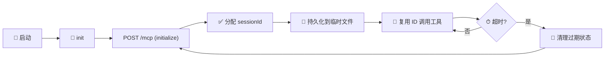

<h1 align="center">chrome-mcp-bridge-2026-skill</h1>

<p align="center">
  <a href="https://img.shields.io/badge/version-3.1.2-6C47FF"></a>
  <a href="https://nodejs.org"></a>
  <a href="https://spec.modelcontextprotocol.io"></a>
  <a href="https://github.com/phoenixlucky/mcp-chrome-2026"></a>
  <a href="LICENSE"></a>
  <a href="./SKILL.md"></a>
</p>

<p align="center">
  <b>将 Streamable HTTP MCP 服务桥接到任何 Stdio MCP 客户端</b><br>
  零外部依赖 · 自动 Session 管理 · 即克隆即用
</p>

---

## 目录

- [📖 概述](#-概述)
- [✨ 核心特性](#-核心特性)
- [🔧 能力矩阵](#-能力矩阵)
- [🚀 快速开始](#-快速开始)
- [💻 CLI 命令参考](#-cli-命令参考)
- [🖥️ AI 客户端配置](#️-ai-客户端配置)
- [📦 项目结构](#-项目结构)
- [⚙️ 技术细节](#️-技术细节)
- [📚 相关资源](#-相关资源)
- [📄 许可证](#-许可证)

---

## 📖 概述

```text
┌─────────────────┐     Stdio MCP      ┌──────────────────┐    HTTP POST+SSE    ┌─────────────────────────┐
│   AI 客户端      │ ◄──────────────►  │  mcp-bridge.js   │ ◄────────────────► │  mcp-chrome-2026        │
│  Claude Desktop  │                   │  Session Manager  │                    │  Chrome 浏览器自动化     │
│  Cursor / VS Code│                   │  自动分配/验证 ID │                    │  http://127.0.0.1:12306 │
│  Windsurf / Cline│                   │  超时自动恢复     │                    │  /mcp                   │
└─────────────────┘                    └──────────────────┘                    └─────────────────────────┘
                                                │
                                         ┌──────┴──────┐
                                         │  Session ID  │
                                         │  持久化层     │
                                         │ %TEMP%/*.json│
                                         └─────────────┘
```

**为什么需要这个桥接？** 许多 MCP 服务使用 Streamable HTTP 传输（需要 HTTP POST + SSE 长连接管理 `sessionId`），但 AI 客户端通常只支持 `stdio`。`mcp-bridge.js` 作为中间层自动管理 Session 生命周期，让任何客户端都能无缝使用。

---

## ✨ 核心特性

<table>
  <tr>
    <td width="33%" align="center">
      <h3>🔌 零配置连接</h3>
      <p>一条命令初始化，Session ID 自动持久化到临时文件，跨调用无缝复用</p>
    </td>
    <td width="33%" align="center">
      <h3>🔄 智能自动恢复</h3>
      <p>Session 超时自动检测 → 清理过期状态 → 重新 init，全程无人工干预</p>
    </td>
    <td width="33%" align="center">
      <h3>📡 双协议解析</h3>
      <p>即时 JSON 响应和 SSE 流式响应均正确解析，兼容所有标准 MCP 服务端</p>
    </td>
  </tr>
  <tr>
    <td width="33%" align="center">
      <h3>📥 --stdin 管道模式</h3>
      <p>通过管道传入 JSON 参数，彻底解决 PowerShell/bash 中 <code>&amp;</code> 等特殊字符被截断问题</p>
    </td>
    <td width="33%" align="center">
      <h3>⚡ 零外部依赖</h3>
      <p>仅使用 Node.js v18+ 内置 <code>fetch</code> API，无需 <code>npm install</code>，克隆即用</p>
    </td>
    <td width="33%" align="center">
      <h3>🧩 通用兼容</h3>
      <p><code>--server</code> 模式下可作为标准 MCP Server，供任意支持 stdio 的客户端使用</p>
    </td>
  </tr>
</table>

---

## 🔧 能力矩阵

对接 [mcp-chrome-2026](https://github.com/phoenixlucky/mcp-chrome-2026) 服务，覆盖 **8 大类 35+ 浏览器自动化工具**（v1.6.4）：

| 分类 | 核心工具 | 能力 |
|:---:|:---|:---|
| <b>📊 浏览器管理</b> | `chrome_navigate` · `chrome_close_tabs` · `chrome_switch_tab` · `chrome_go_back_or_forward` | 页面导航、标签页管理、历史控制 |
| <b>📸 截图视觉</b> | `chrome_screenshot` | 全页/元素截图、自定义视口、base64 输出 |
| <b>🌐 网络监控</b> | `chrome_network_capture` · `chrome_network_request` · `chrome_block_images` | 请求捕获、自定义请求、资源拦截 |
| <b>🔍 内容分析</b> | `search_tabs_content` · `chrome_get_page_text` · `chrome_extract` · `chrome_get_interactive_elements` | 语义搜索、Readability 正文解析、结构化提取、交互元素检测 |
| <b>🎯 交互操作</b> | `chrome_click_element` · `chrome_fill_or_select` · `chrome_keyboard` | 点击、表单填写、键盘快捷键 |
| <b>💻 脚本执行</b> | `chrome_javascript` · `chrome_console` | 页面 JS 执行、控制台日志捕获 |
| <b>📚 数据管理</b> | `chrome_history` · `chrome_bookmark_*` · 🆕 `chrome_cookie_*` | 历史记录检索、书签 CRUD、**Cookie 管理（v1.6.4 新增）** |
| <b>🕸️ 抓取提取</b> | `chrome_scroll` · `chrome_wait` · `chrome_extract` · `chrome_get_page_text` · `chrome_click_and_wait` · 🆕 `chrome_spa_fetch` | 滚动控制、等待元素、结构化提取、文章解析、组合操作、**SPA 专用提取** |

> 💡 执行 `node mcp-bridge.js call tools/list` 可获取实时工具列表及参数签名。详细 AI 操作指南请参阅 [SKILL.md](./SKILL.md)。

---

## 🚀 快速开始

### 前置条件

<div align="center">

| 需求 | 版本/说明 |
|:---|:---|
|  | **≥ 18**（内置 `fetch` API） |
|  | 已安装（用于 Chrome 扩展） |
|  | `npm i -g @ethanwilkins/mcp-chrome-bridge-2026` |

</div>

### 第一步：启动后端 MCP 服务

```bash
# 安装桥接器（postinstall 自动注册 Native Messaging Host）
npm install -g @ethanwilkins/mcp-chrome-bridge-2026

# 启动 Chrome MCP 服务
mcp-chrome-bridge start
```

验证服务是否在线：

```bash
curl -s -o /dev/null -w "%{http_code}" http://127.0.0.1:12306/mcp
# 预期输出: 200
```

### 第二步：获取桥接脚本

```bash
git clone https://github.com/phoenixlucky/chrome-mcp-bridge-2026-skill.git
cd chrome-mcp-bridge-2026-skill
```

### 第三步：使用方式

#### 🅰️ 通过 MCP 客户端（推荐）

从仓库模板复制生成 `.mcp.json`（仓库内不直接存放 `.mcp.json`，避免被智能助手自动扫描）：

```powershell
Copy-Item .mcp.json.example .mcp.json
```

再将模板中的 `__BRIDGE_PATH__` 替换为本机 `mcp-bridge.js` 的绝对路径（在仓库根目录运行 `node mcp-bridge.js path` 可取得该路径）：

```json
{
  "mcpServers": {
    "chrome": {
      "command": "node",
      "args": ["C:\\full\\path\\to\\mcp-bridge.js", "--server"],
      "env": {
        "MCP_SERVER_URL": "http://127.0.0.1:12306/mcp"
      }
    }
  }
}
```

启动客户端后，`chrome_*` 工具自动暴露。

> 若报 `Cannot find module ...\.reasonix\skills\chrome-mcp-bridge-2026-skill\mcp-bridge.js`，该配置指向了已废弃的相对路径。将 `args` 中的第一个值替换为本机 `mcp-bridge.js` 的绝对路径；在本仓库根目录运行 `node mcp-bridge.js path` 可取得该路径。

#### 🅱️ CLI 直接调用

```powershell
# 初始化连接
node mcp-bridge.js init

# 列出可用工具
node mcp-bridge.js call tools/list

# 调用工具（--stdin 避免 PowerShell & 转义）
$body = @'
{"name":"chrome_navigate","arguments":{"url":"https://example.com"}}
'@
$body | node mcp-bridge.js call tools/call --stdin

# 关闭连接
node mcp-bridge.js close
```

---

## 💻 CLI 命令参考

| 命令 | 参数 | 说明 |
|:---|:---|:---|
| `init` | — | 初始化 MCP 连接，获取 Session ID |
| `call` | `<method>` `[params\|--stdin]` | 调用 JSON-RPC 方法 |
| `ping` | — | 心跳保活，延长 Session 有效期 |
| `close` | — | 发送 Close 通知，清理 Session 文件 |
| `path` | — | 输出脚本自身绝对路径 |
| _(无参数)_ | — | 显示帮助信息 |

### 参数传递方式

```powershell
# 方式一：命令行直接传入（适合简单参数）
node mcp-bridge.js call tools/call '{"name":"chrome_navigate","arguments":{"url":"https://example.com"}}'

# 方式二：--stdin 管道模式（推荐 ✅）
echo '{"name":"chrome_navigate","arguments":{"url":"https://example.com"}}' | node mcp-bridge.js call tools/call --stdin

# 方式三：文件重定向
node mcp-bridge.js call tools/call --stdin < params.json
```

> ⚠️ **PowerShell 用户注意**：`&` 是命令分隔符，直接传含 `&` 的 JSON 参数会失败。**务必使用 `--stdin` 管道模式。**

---

## 🖥️ AI 客户端配置

### Claude Desktop

编辑 `claude_desktop_config.json`：

```json
{
  "mcpServers": {
    "chrome": {
      "command": "node",
      "args": ["C:\\path\\to\\mcp-bridge.js", "--server"],
      "env": {
        "MCP_SERVER_URL": "http://127.0.0.1:12306/mcp"
      }
    }
  }
}
```

### VS Code (Cline / Continue)

在项目 `.mcp.json` 或全局 MCP 配置中添加相同配置。

### Cursor

在 **Settings → MCP Servers** 中添加：

| 字段 | 值 |
|:---|:---|
| **Name** | `chrome` |
| **Type** | `command` |
| **Command** | `node` |
| **Args** | `["path/to/mcp-bridge.js", "--server"]` |

### Codex

在项目根目录创建 `.cursor/mcp.json`（Codex 兼容 Cursor 的 MCP 配置格式）：

```json
{
  "mcpServers": {
    "chrome": {
      "command": "node",
      "args": ["path/to/mcp-bridge.js", "--server"]
    }
  }
}
```

### Windsurf

在 `windsurf.json` 或 MCP 配置中添加 stdio server，指向本脚本。

> **原理通用**：任一客户端只需配置一个 `stdio` MCP Server，`command` 为 `node`，`args` 为 `["<脚本绝对路径>", "--server"]`。

---

## 📦 项目结构

```
chrome-mcp-bridge-2026-skill/
├── 📄 mcp-bridge.js      核心桥接脚本（Node.js，零外部依赖）
├── 📘 SKILL.md           AI 代理操作手册（自动配置 + CLI 速查）
├── 📖 README.md          本文件（项目首页）
├── ⚙️ .mcp.json.example MCP 配置模板（安装时生成 `.mcp.json`）
├── 🔒 .gitignore         版本控制忽略规则
└── ⚖️ LICENSE            MIT 许可证
```

---

## ⚙️ 技术细节

### Session 生命周期



| 阶段 | 请求头 | 响应处理 |
|:---|:---|:---|
| **初始化** | `Accept: text/event-stream, application/json` | 提取 `Mcp-Session-Id` 响应头 |
| **调用** | `Mcp-Session-Id: <id>` + 同上 Accept | 解析 JSON 或 SSE 流 |
| **通知** | 同上 | 无需等待响应 |

### 环境变量

| 变量 | 默认值 | 说明 |
|:---|:---|:---|
| `MCP_SERVER_URL` | `http://127.0.0.1:12306/mcp` | 后端 MCP 服务地址 |
| `DEBUG` | _(空)_ | 设为 `1` 开启调试日志 |

### 兼容性

| 特性 | 状态 |
|:---|:---:|
| MCP Streamable HTTP 规范 | ✅ 完全遵循 |
| Node.js v18+ | ✅ 内置 `fetch`，零依赖 |
| SSE 流式响应 | ✅ 正确解析 |
| Session 自动恢复 | ✅ 超时 → 清理 → 重建 |
| `--server` 标准 MCP 模式 | ✅ 多客户端兼容 |

---

## 📚 相关资源

<div align="center">

| 资源 | 链接 |
|:---|:---|
|  | [spec.modelcontextprotocol.io](https://spec.modelcontextprotocol.io) |
|  | [github.com/phoenixlucky/mcp-chrome-2026](https://github.com/phoenixlucky/mcp-chrome-2026) |
|  | [reasonix.ai](https://reasonix.ai) |
|  | [TOOLS_zh.md](https://github.com/phoenixlucky/mcp-chrome-2026/blob/master/docs/TOOLS_zh.md) |
|  | [SKILL.md](./SKILL.md) |

</div>

---

<p align="center">
  <a href="LICENSE"></a>
  <br>
  <b>© 2026 <a href="https://github.com/phoenixlucky">phoenixlucky</a></b>
  <br>
  <sub>Built with ❤️ for the MCP ecosystem</sub>
</p>
