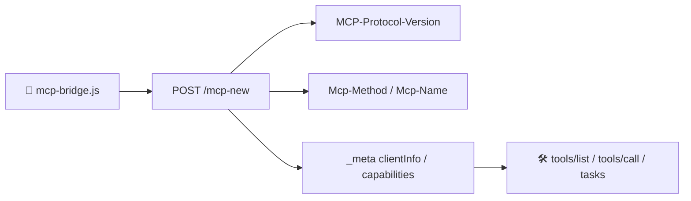

<h1 align="center">chrome-mcp-bridge-2026-skill</h1>

<p align="center">🕷️</p>

<p align="center">
  <a href="https://img.shields.io/badge/version-3.5.0-6C47FF"></a>
  <a href="https://nodejs.org"></a>
  <a href="https://spec.modelcontextprotocol.io"></a>
  <a href="https://github.com/phoenixlucky/mcp-chrome-2026"></a>
  <a href="LICENSE"></a>
  <a href="./SKILL.md"></a>
</p>

<p align="center">
  <b>连接 Chrome MCP 2026-07-28 无状态端点</b><br>
  `/mcp-new` · Header 路由 · MRTR / Tasks 透传 · `/mcp` 兼容回退
</p>

---

## 目录

- [📖 概述](#-概述)
- [✨ 核心特性](#-核心特性)
- [🔧 能力矩阵](#-能力矩阵)
- [🚀 快速开始](#-快速开始)
- [💻 Bridge CLI 命令参考](#-bridge-cli-命令参考)
- [🖥️ AI 客户端配置](#️-ai-客户端配置)
- [📦 项目结构](#-项目结构)
- [⚙️ 技术细节](#️-技术细节)
- [📚 相关资源](#-相关资源)
- [📄 许可证](#-许可证)

---

## 📖 概述

```text
┌─────────────────┐     Stdio MCP      ┌──────────────────────┐    HTTP POST       ┌─────────────────────────┐
│   AI 客户端      │ ◄──────────────►  │  mcp-bridge.js       │ ◄────────────────► │  mcp-chrome-2026        │
│  Claude / Cursor │                   │  新协议适配 / 兼容    │                    │  Chrome 浏览器自动化     │
│  VS Code / Codex│                   │  无状态 / MRTR / Tasks │                    │  /mcp-new               │
│  Windsurf / Cline│                  │  Header / API Key      │                    │  /mcp（兼容）            │
└─────────────────┘                    └──────────────────────┘                    └─────────────────────────┘
```

上游已提供 `/mcp-new` 尝鲜端点，对应 MCP `2026-07-28` 的无状态协议。本项目的 `mcp-bridge.js` 现在默认连接该端点：每次请求携带协议元数据和 `Mcp-Method`/`Mcp-Name` Header，不写入或复用 Session。显式把 `MCP_SERVER_URL` 指向 `/mcp`，或设置 `MCP_PROTOCOL_MODE=legacy`，仍可连接旧版兼容端点。

---

## ✨ 核心特性

<table>
  <tr>
    <td width="33%" align="center">
      <h3>🔌 无状态连接</h3>
      <p>默认连接 <code>/mcp-new</code>，每个请求可独立路由</p>
    </td>
    <td width="33%" align="center">
      <h3>🧩 MRTR / Tasks</h3>
      <p>透传 <code>input_required</code>、<code>requestState</code> 和 Tasks 扩展</p>
    </td>
    <td width="33%" align="center">
      <h3>📡 双端点兼容</h3>
      <p><code>/mcp-new</code> 新协议与 <code>/mcp</code> 旧协议均可用</p>
    </td>
  </tr>
  <tr>
    <td width="33%" align="center">
      <h3>🛡️ Origin / API Key</h3>
      <p>支持 <code>MCP_SERVER_ORIGIN</code> 与 <code>CHROME_MCP_API_KEY</code> 转发</p>
    </td>
    <td width="33%" align="center">
      <h3>🧭 Header 路由</h3>
      <p>方法和工具名放入 HTTP Header，网关可直接路由</p>
    </td>
    <td width="33%" align="center">
      <h3>🔙 兼容回退</h3>
      <p>指向 <code>/mcp</code> 即可继续使用旧 Session 协议</p>
    </td>
  </tr>
</table>

---

## 🔧 能力矩阵

对接 [mcp-chrome-2026](https://github.com/phoenixlucky/mcp-chrome-2026) 服务，动态暴露完整浏览器自动化工具目录（v2.5.x）：

| 分类 | 核心工具 | 能力 |
|:---:|:---|:---|
| <b>📊 浏览器管理</b> | `get_windows_and_tabs` · `chrome_navigate` · 🆕 `chrome_create_tab` · `chrome_close_tabs` · `chrome_switch_tab` · `chrome_javascript` | 页面导航、标签页管理、JS 注入 |
| <b>🤖 视觉交互新范式</b> | 🆕 `chrome_read_page` · 🆕 `chrome_computer` · 🆕 `chrome_request_element_selection` | 无障碍树读页（带 ref）、鼠标键盘综合操作、人工点选回退 |
| <b>📸 截图视觉</b> | `chrome_screenshot` · `chrome_gif_recorder` | 全页/元素截图、GIF 录制（固定帧率/自动采集） |
| <b>🌐 网络监控</b> | `chrome_network_capture`（v2.0 合并 start/stop/debugger） · `chrome_network_request` · `chrome_block_images` · `chrome_block_resources` | 请求捕获+响应正文、自定义请求、资源拦截 |
| <b>🔍 内容分析</b> | `search_tabs_content` · `chrome_get_web_content` · `chrome_get_page_text` · `chrome_extract` · `chrome_console` | 语义搜索、Readability 正文解析、结构化提取、控制台采集 |
| <b>🖱️ 交互与表单</b> | `chrome_click_element` · `chrome_fill_or_select` · `chrome_keyboard` · 🆕 `chrome_hover` · 🆕 `chrome_locate_element` · 🆕 `chrome_get_element_info` · 🆕 `chrome_get_form_value` · 🆕 `chrome_handle_dialog` | 点击、表单填写、键盘、悬停、元素定位/信息查询、对话框处理 |
| <b>✍️ 富媒体输入</b> | 🆕 `chrome_paste_text` · 🆕 `chrome_paste_image` · 🆕 `chrome_upload_file` · 🆕 `chrome_post_to_x` | 富文本粘贴（Draft.js 系）、图片粘贴、文件上传、X 发帖 |
| <b>📚 数据管理</b> | `chrome_history` · `chrome_bookmark_*` · `chrome_cookie_*` · 🆕 `chrome_storage_*` | 历史检索、书签 CRUD、Cookie 管理、localStorage/sessionStorage CRUD |
| <b>⬇️ 下载导出</b> | 🆕 `chrome_handle_download` · 🆕 `chrome_print_to_pdf` | 等待下载完成、页面打印 PDF |
| <b>🛡️ 代理管理</b> | `chrome_proxy_diagnostics` · `chrome_proxy_rotate` | 代理诊断/出口 IP 测试、异常时轮换代理会话 |
| <b>🕸️ Profile 与批量</b> | 🆕 `chrome_profile` · 🆕 `chrome_batch` | 隔离浏览器 Profile 管理、整组任务批量执行 |
| <b>🕸️ 采集提取</b> | `chrome_scroll` · `chrome_wait` · `chrome_extract` · `chrome_spa_fetch` · `collect_virtual_list` · 🆕 `collect_virtual_lists` · `chrome_paginate_extract` · `wait_extract_response` | 滚动控制、等待元素/网络响应、SPA 提取、虚拟列表并发采集、分页提取 |
| <b>🧩 高级辅助</b> | `chrome_scoped_action` · `chrome_task_context` · `chrome_diagnostic_snapshot` · `capture_debug_bundle` · 🆕 `chrome_select_all_items` · `detect_empty_state` · `merge_records` | 限定作用域操作、任务上下文、诊断快照、失败现场打包、安全全选 |
| <b>📊 性能追踪</b> | 🆕 `performance_start_trace` · 🆕 `performance_stop_trace` · 🆕 `performance_analyze_insight` | 性能追踪记录与洞察摘要 |

> 🔑 **全局公共参数（v2.1+）**：所有工具支持 `profileId`（隔离环境）、`intent`（操作意图显示）、`expectedUrl`（URL 安全护栏）、`actionPolicy`（fast/balanced/human 动作节奏）。
>
> 💡 由 MCP 客户端启动 `node mcp-bridge.js --server` 即可获取实时工具列表；CLI 可执行 `node mcp-bridge.js call tools/list`。详细 AI 操作指南请参阅 [SKILL.md](./SKILL.md)。

### 2026-07-28 升级摘要

| 旧实现 | 新实现 |
|:---|:---|
| Session / `Mcp-Session-Id` | `/mcp-new` 无状态请求 |
| JSON 体内判断路由 | `Mcp-Method` / `Mcp-Name` Header |
| `initialize` 后再调用 | 可选 `server/discover`，每次请求带 `_meta` |
| 服务端反向长连接 | MRTR 的 `input_required` + `inputResponses` |
| 实验性 Tasks | `tasks/get` / `tasks/update` 扩展透传 |
| HTTP+SSE / Roots / Sampling / Logging | 旧端点兼容保留，新端点不主动采用 |

---

## 🚀 快速开始

### 前置条件

<div align="center">

| 需求 | 版本/说明 |
|:---|:---|
|  | **≥ 24**（上游 2.4.x 要求） |
|  | 已安装（用于 Chrome 扩展） |
|  | `npm i -g @ethanwilkins/mcp-chrome-bridge-2026` |

</div>

### 第一步：启动后端 MCP 服务

```bash
# 安装上游原生 MCP 包（postinstall 自动注册 Native Messaging Host）
npm install -g @ethanwilkins/mcp-chrome-bridge-2026

# 启动 Chrome MCP 服务
mcp-chrome-bridge start
```

验证服务是否在线：

```bash
curl -s -o /dev/null -w "%{http_code}" -X POST http://127.0.0.1:12306/mcp-new
# 预期输出: 200 或 400（取决于是否带完整 MCP 请求；端口在线即可）
```

### 第二步：获取配置模板

```bash
git clone https://github.com/phoenixlucky/chrome-mcp-bridge-2026-skill.git
cd chrome-mcp-bridge-2026-skill
```

### 第三步：使用方式

#### 🅰️ 通过 MCP 客户端（推荐）

从仓库模板生成 `.mcp.json`（仓库内不直接存放 `.mcp.json`，避免被智能助手自动扫描；安装步骤会把 `__BRIDGE_PATH__` 替换为绝对路径）：

```powershell
Copy-Item .mcp.json.example .mcp.json
# 然后按 SKILL.md 的配置步骤，把 __BRIDGE_PATH__ 替换为实际 mcp-bridge.js 绝对路径
```

```json
{
  "mcpServers": {
    "chrome": {
      "command": "node",
      "args": ["__BRIDGE_PATH__", "--server"],
      "env": {
        "MCP_SERVER_URL": "http://127.0.0.1:12306/mcp-new",
        "MCP_PROTOCOL_MODE": "stateless",
        "MCP_SERVER_ORIGIN": "http://127.0.0.1"
      }
    }
  }
}
```

启动客户端后，`chrome_*` 工具自动暴露。

`MCP_SERVER_URL` 未设置时默认使用 `http://127.0.0.1:12306/mcp-new`；需要旧协议时改为 `/mcp`，或设置 `MCP_PROTOCOL_MODE=legacy`。`MCP_SERVER_ORIGIN` 可按部署环境覆盖。
如果服务启用了 API Key，在同一个 `env` 对象中增加 `CHROME_MCP_API_KEY`；不要把真实密钥提交到仓库。

#### 🅱️ 手动 stdio 握手

```powershell
# MCP stdio 使用换行分隔 JSON；bridge 会在新端点上本地完成兼容握手
$body = @'
{"jsonrpc":"2.0","id":1,"method":"initialize","params":{"protocolVersion":"2026-07-28","capabilities":{},"clientInfo":{"name":"manual-check","version":"1.0"}}}
'@
$body | node mcp-bridge.js --server
```

#### 🅲️ Bridge CLI

需要手动调用 JSON-RPC、只支持 stdio 的客户端，或需要 bridge 的重试/诊断行为时，使用 `mcp-bridge.js`。默认连接 `/mcp-new`；它会发送 `Origin`、`MCP-Protocol-Version`、`Mcp-Method`，工具调用还会发送 `Mcp-Name`，并在设置 `CHROME_MCP_API_KEY` 时转发 Bearer API Key。

---

## 💻 Bridge CLI 命令参考

这些命令用于手动诊断、CLI 调用和只支持 stdio 的客户端；默认连接新端点，旧端点用 `MCP_PROTOCOL_MODE=legacy` 显式启用。

| 命令 | 参数 | 说明 |
|:---|:---|:---|
| `init` | — | 新端点调用 `server/discover`；旧端点调用 `initialize` |
| `call` | `<method>` `[params\|--stdin]` | 调用 JSON-RPC 方法 |
| `ping` | — | 新端点转发无状态 ping；旧端点为兼容心跳 |
| `close` | — | 关闭连接；新端点不清理 Session |
| `path` | — | 输出脚本自身绝对路径 |
| _(无参数)_ | — | 显示帮助信息 |

### 参数传递方式

```powershell
# 方式一：命令行直接传入（适合简单参数）
node mcp-bridge.js call tools/call '{"name":"chrome_navigate","arguments":{"url":"https://example.com"}}'

# 方式二：--stdin 管道模式（推荐 ✅）
echo '{"name":"chrome_navigate","arguments":{"url":"https://example.com"}}' | node mcp-bridge.js call tools/call --stdin

# 方式三：文件重定向
node mcp-bridge.js call tools/call --stdin < params.json
```

> ⚠️ **PowerShell 用户注意**：`&` 是命令分隔符，直接传含 `&` 的 JSON 参数会失败。**务必使用 `--stdin` 管道模式。**

### 实时进度通知

`--server` 模式会增量解析后端的 SSE 响应。后端发送的 `notifications/progress` 等无 `id` JSON-RPC 通知会立即转发到上游 stdio 客户端，工具最终结果仍按原请求 `id` 返回。

调用方需要在 `tools/call` 的 `_meta` 中提供 `progressToken`，例如：

```json
{
  "name": "collect_virtual_list",
  "arguments": {
    "cardSelector": ".card",
    "fields": [{ "name": "id", "selector": "[data-id]", "type": "attribute", "attribute": "data-id" }],
    "identityFields": ["id"]
  },
  "_meta": { "progressToken": "collect-1" }
}
```

CLI 模式会把收到的通知写入 stderr，最终 JSON 仍写入 stdout，方便脚本继续解析最终结果。

---

## 🖥️ AI 客户端配置

### Claude Desktop

编辑 `claude_desktop_config.json`：

```json
{
  "mcpServers": {
    "chrome": {
      "command": "node",
      "args": ["C:\\path\\to\\mcp-bridge.js", "--server"],
      "env": {
        "MCP_SERVER_URL": "http://127.0.0.1:12306/mcp-new",
        "MCP_PROTOCOL_MODE": "stateless",
        "MCP_SERVER_ORIGIN": "http://127.0.0.1"
      }
    }
  }
}
```

### VS Code (Cline / Continue)

在项目 `.mcp.json` 或全局 MCP 配置中添加相同配置。

### Cursor

在 **Settings → MCP Servers** 中添加：

| 字段 | 值 |
|:---|:---|
| **Name** | `chrome` |
| **Type** | `command` |
| **Command** | `node C:\\path\\to\\mcp-bridge.js --server` |

### Codex

在项目根目录创建 `.cursor/mcp.json`（Codex 兼容 Cursor 的 MCP 配置格式）：

```json
{
  "mcpServers": {
    "chrome": {
      "command": "node",
      "args": ["C:\\path\\to\\mcp-bridge.js", "--server"],
      "env": {
        "MCP_SERVER_URL": "http://127.0.0.1:12306/mcp-new",
        "MCP_PROTOCOL_MODE": "stateless",
        "MCP_SERVER_ORIGIN": "http://127.0.0.1"
      }
    }
  }
}
```

### Windsurf

在 `windsurf.json` 或 MCP 配置中添加 stdio server，命令设置为 `node C:\\path\\to\\mcp-bridge.js --server`。

> **原理通用**：任一客户端只需配置一个 `stdio` MCP Server，启动 `mcp-bridge.js --server`，并按需设置 `MCP_SERVER_URL`、`MCP_PROTOCOL_MODE`、`MCP_SERVER_ORIGIN` 和 `CHROME_MCP_API_KEY`。

---

## 📦 项目结构

```
chrome-mcp-bridge-2026-skill/
├── 📄 mcp-bridge.js      stdio bridge（默认适配 /mcp-new，也兼容 /mcp）
├── 📘 SKILL.md           AI 代理操作手册（自动配置 + CLI 速查）
├── 📖 README.md          本文件（项目首页）
├── ⚙️ .mcp.json.example MCP 配置模板（安装时生成 `.mcp.json`）
├── 🔒 .gitignore         版本控制忽略规则
└── ⚖️ LICENSE            MIT 许可证
```

---

## ⚙️ 技术细节

### `/mcp-new` 无状态 Transport



| 阶段 | 负责组件 | 说明 |
|:---|:---|:---|
| **stdio** | `mcp-bridge.js --server` | MCP 客户端通过 stdin/stdout 连接 |
| **HTTP** | `/mcp-new` | POST-only、无 Session，按请求携带协议元数据 |
| **路由** | HTTP Header | `Mcp-Method`，工具调用附加 `Mcp-Name` |
| **鉴权** | 环境变量 | `Origin` 与可选 Bearer API Key 由入口转发 |

### 环境变量

| 变量 | 默认值 | 说明 |
|:---|:---|:---|
| `MCP_SERVER_URL` | `http://127.0.0.1:12306/mcp-new` | 后端 MCP 服务地址；`/mcp` 保留旧协议 |
| `MCP_PROTOCOL_MODE` | `auto` | `auto`、`stateless` 或 `legacy` |
| `MCP_PROTOCOL_VERSION` | 按端点选择 | 新端点默认 `2026-07-28`，旧端点默认 `2025-11-25` |
| `MCP_SERVER_ORIGIN` | `http://127.0.0.1` | 后端允许的 Origin |
| `CHROME_MCP_API_KEY` | _(空)_ | 可选 API Key，转发为 `Authorization: Bearer ...` |
| `DEBUG` | _(空)_ | 设为 `1` 开启调试日志 |

### 兼容性

| 特性 | 状态 |
|:---|:---:|
| MCP `2026-07-28` `/mcp-new` | ✅ 无状态请求、Header 路由 |
| `server/discover` | ✅ `init` 命令映射 |
| MRTR / Tasks / Extensions | ✅ 结果和方法透传 |
| `tools/list` cache hints | ✅ 保留 `ttlMs` / `cacheScope`，按 TTL 缓存 |
| `/mcp` 旧端点 | ✅ 自动识别并保留 Session 兼容 |

---

## 📚 相关资源

<div align="center">

| 资源 | 链接 |
|:---|:---|
|  | [spec.modelcontextprotocol.io](https://spec.modelcontextprotocol.io) |
|  | [github.com/phoenixlucky/mcp-chrome-2026](https://github.com/phoenixlucky/mcp-chrome-2026) |
|  | [reasonix.ai](https://reasonix.ai) |
|  | [TOOLS_zh.md](https://github.com/phoenixlucky/mcp-chrome-2026/blob/master/docs/TOOLS_zh.md) |
|  | [SKILL.md](./SKILL.md) |

</div>

---

<p align="center">
  <a href="LICENSE"></a>
  <br>
  <b>© 2026 <a href="https://github.com/phoenixlucky">phoenixlucky</a></b>
  <br>
  <sub>Built with ❤️ for the MCP ecosystem</sub>
</p>
